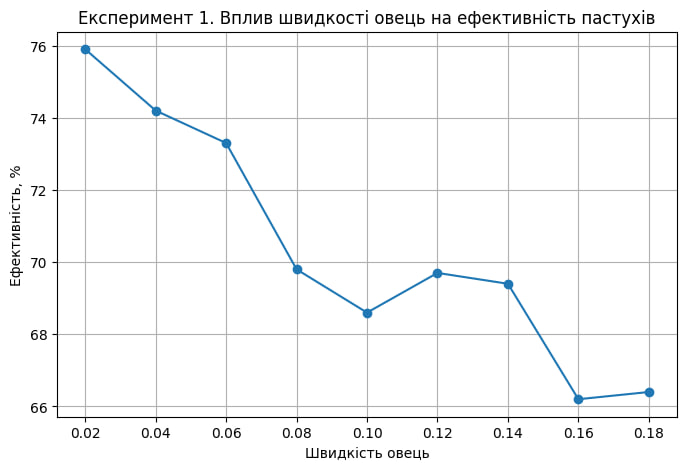
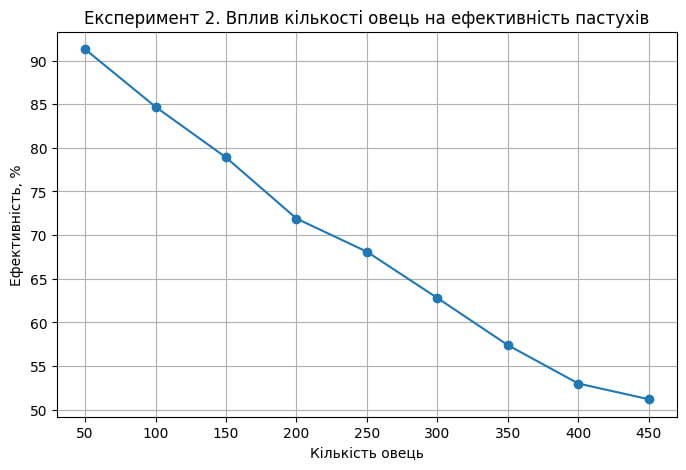
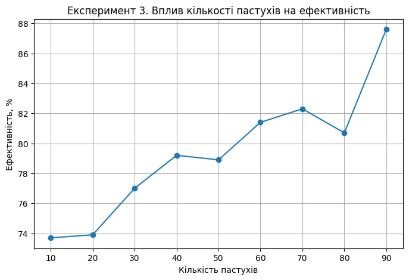

## Комп'ютерні системи імітаційного моделювання
## СПм-24-1, **Литовка Данило Вадимович**
### Лабораторна робота №**1**. Опис імітаційних моделей та проведення обчислювальних експериментів

 

### Варіант 9, модель у середовищі NetLogo:
[Sheperds](https://www.netlogoweb.org/launch#http://www.netlogoweb.org/assets/modelslib/Sample%20Models/Biology/Shepherds.nlogox)
Симуляція процесу пошуку та збирання вівць у стада.

 

### Вербальний опис моделі:

Симуляція збору овець пастухами у стадо. Пастухи дотримуються низки простих правил. Кожен пастух починає блукати випадковим чином. Якщо він натикається на вівцю, він підбирає її та продовжує безладно блукати. Коли він натикається на іншу вівцю (знаходить стадо), він шукає вільне місце поблизу, кладе свою вівцю та шукає іншу. З часом цей процес призводить до групування розрізнених овець у компактні стада.

### Керуючі параметри:

-   **num-sheep**: кількість овець у моделі. Цей параметр визначає, скільки овець буде створено під час ініціалізації моделі.
    
-   **num-shepherds**: кількість пастухів у моделі. Цей параметр задає кількість пастухів, які будуть взаємодіяти з вівцями.
    
-   **sheep-speed**: швидкість переміщення овець. Визначає, як швидко вівці рухатимуться по простору, що впливає на складність утримання стада.
    

### Внутрішні параметри:

-   **pcolor**: колір патчів (ділянок землі), який варіюється у відтінках зеленого для покращення візуалізації.
    
-   **sheep-nearby**: (змінна `patches-own`) кількість овець у сусідніх патчах; використовується для аналізу щільності розподілу овець.
    
-   **carried-sheep**: (змінна `shepherds-own`) посилання на вівцю, яку зараз несе пастух. Якщо пастух вільний, значення дорівнює `nobody`.
    
-   **found-herd?**: (змінна `shepherds-own`) булева змінна, яка стає `true`, коли пастух з вівцею знаходить іншу вівцю, сигналізуючи про готовність залишити вантаж.
    
-   **hidden?**: (вбудована змінна `sheep`) використовується для того, щоб зробити вівцю невидимою та "недоступною" для інших пастухів, поки її хтось несе.
    

### Показники роботи системи:

-   **sheepless-neighborhoods**: кількість патчів, навколо яких немає жодної вівці. Цей показник демонструє, наскільки територія очищена від розрізнених тварин.
    
-   **herding-efficiency**: ефективність збирання. Обчислюється як відсоткове співвідношення патчів без овець у їхньому оточенні до загальної кількості патчів без овець. Чим вищий відсоток, тим краще згруповані вівці.
    

### Примітки:

Пастух змінює свій колір на **синій**, коли несе вівцю, і повертає колір на **коричневий** після того, як її залишає. Це слугує візуальним індикатором активності пастухів у реальному часі.

### Недоліки моделі:

1.  **Низька ефективність пошуку**: Оскільки і вівці, і пастухи рухаються випадковим чином (`wiggle`), пастухи можуть витрачати багато часу на пошук овець, навіть якщо ті знаходяться зовсім поруч.
    
2.  **Хаотичність**: Модель базується на випадкових блуканнях, тому пастухи не мають "пам'яті" про розташування стад, що робить процес менш схожим на реальний інтелектуальний випас.
    
3.  **Розпад стада**: Якщо параметр `sheep-speed` встановлено на високе значення, вівці розбігаються швидше, ніж пастухи встигають їх збирати.

 

## Обчислювальні експерименти

### 1. Вплив швидкості овець на ефективність
Досліджується залежність ефективності пастухів протягом певної кількості тактів (500) від швидкості овець, зазначеного на початку симуляції.
Експерименти проводяться при швидкості овець 0.02-0.18 , з кроком 0.02, усього 9 симуляцій.
Інші керуючі параметри мають значення за замовчуванням:
- **num-shepherds:**: 30
- **num-sheep**: 150

<table>
<thead>
<tr><th>Швидкість овець</th><th>Ефективність</th></tr>
</thead>
<tbody>
<tr><td>0.02</td><td>75.9</td></tr>
<tr><td>0.04</td><td>74.2</td></tr>
<tr><td>0.06</td><td>73.3</td></tr>
<tr><td>0.08</td><td>69.8</td></tr>
<tr><td>0.10</td><td>68.6</td></tr>
<tr><td>0.12</td><td>69.7</td></tr>
<tr><td>0.14</td><td>69.4</td></tr>
<tr><td>0.16</td><td>66.2</td></tr>
<tr><td>0.18</td><td>66.4</td></tr>
</tbody>
</table>

Графік демонструє ефективності збирання овець від швидкості овець. Він наочно ілюструє постійне падіння ефективності по мірі збільшення швидкості овець. При цьому стада перестать формуватись на швидкості понад 0.6, оскільки вівці встигають розбігатись до того як їх повернуть у стадо пастухи. 

### 2. Вплив кількості овець на ефективність
Досліджується залежність ефективності пастухів протягом певної кількості тактів (500) від кількості овець, зазначеного на початку симуляції.
Експерименти проводяться при 50-450 вівцях, з кроком 50, усього 9 симуляцій.
Інші керуючі параметри мають значення за замовчуванням:
- **num-shepherds:**: 30
- **sheep-speed**: 0.02

<table>
<thead>
<tr><th>Кількість овець</th><th>Ефективність</th></tr>
</thead>
<tbody>
<tr><td>50</td><td>91.3</td></tr>
<tr><td>100</td><td>84.7</td></tr>
<tr><td>150</td><td>78.9</td></tr>
<tr><td>200</td><td>71.9</td></tr>
<tr><td>250</td><td>68.1</td></tr>
<tr><td>300</td><td>62.8</td></tr>
<tr><td>350</td><td>57.4</td></tr>
<tr><td>400</td><td>53</td></tr>
<tr><td>450</td><td>51.2</td></tr>
</tbody>
</table>

Графік демонструє залежність ефективності збирання овець від кількості овець. Він наочно ілюструє постійне падіння ефективності по мірі збільшення кількості овець.

### 3. Вплив кількості пастухів на ефективність
Досліджується залежність ефективності пастухів протягом певної кількості тактів (500) від їх кількості, зазначеного на початку симуляції.
Експерименти проводяться при 10-90 пастухах, з кроком 10, усього 9 симуляцій.
Інші керуючі параметри мають значення за замовчуванням:
- **num-sheep**: 150
- **sheep-speed**: 0.02

<table>
<thead>
<tr><th>Кількість пастухів</th><th>Ефективність</th></tr>
</thead>
<tbody>
<tr><td>10</td><td>73.7</td></tr>
<tr><td>20</td><td>73.9</td></tr>
<tr><td>30</td><td>77</td></tr>
<tr><td>40</td><td>79.2</td></tr>
<tr><td>50</td><td>78.9</td></tr>
<tr><td>60</td><td>81.4</td></tr>
<tr><td>70</td><td>82.3</td></tr>
<tr><td>80</td><td>80.7</td></tr>
<tr><td>90</td><td>87.6</td></tr>
</tbody>
</table>

Графік демонструє залежність ефективності збирання овець від кількості пастухів. Він наочно ілюструє зростання ефективності до певного моменту, а також коливання на високих значеннях кількості пастухів через випадковість руху.