## Комп'ютерні системи імітаційного моделювання
## СПм-24-1, **Литовка Данило Вадимович**
### Лабораторна робота №**2**. Редагування імітаційних моделей у середовищі NetLogo

<br>

### Варіант 9, модель у середовищі NetLogo:
[Sheperds](https://www.netlogoweb.org/launch#http://www.netlogoweb.org/assets/modelslib/Sample%20Models/Biology/Shepherds.nlogox)
Симуляція процесу пошуку та збирання вівць у стада.

Поділити вівець на два різних стада, відповідно і пастухів на дві різні організації. Пастухи повинні збирати тільки "своїх" вівець. Додати відключаєму можливість збирати "чужих" вівець, які після потрапляння до нового стада змінюють свою приналежність.

<br>

# Опис модифікованної моделі Shepherds (NetLogo)

### Вербальний опис моделі:

Симуляція збору овець пастухами у стадо. Пастухи дотримуються низки простих правил. Кожен пастух починає блукати випадковим чином. Якщо він натикається на вівцю, він підбирає її та продовжує безладно блукати. Коли він натикається на іншу вівцю (знаходить стадо), він шукає вільне місце поблизу, кладе свою вівцю та шукає іншу.

У модифікованій версії моделі вівці та пастухи розділені на два незалежні табори (червоні та сині), кожен з яких має власну територію (загін) та показники ефективності.

### Керуючі параметри:

-   **num-red-shepherds**: кількість червоних пастухів (тип 1).
    
-   **num-blue-shepherds**: кількість синіх пастухів (тип 2).
    
-   **num-sheep**: загальна кількість овець у моделі.
    
-   **sheep-speed**: швидкість переміщення овець.
    
-   **steal-chanse**: ймовірність того, що пастух підбере вівцю кольору протилежної команди.
    
-   **kill-chanse**: ймовірність загибелі пастуха при зустрічі з групою противників.
    
-   **gang-size**: мінімальна кількість пастухів противника поруч для спрацювання механіки вбивства.
    

### Внутрішні параметри:

-   **pcolor**: колір патчів, що варіюється у відтінках зеленого.
    
-   **sheep-nearby**: (patches-own) кількість овець у сусідніх патчах.
    
-   **carried-sheep**: (shepherds1/2-own) посилання на вівцю, яку несе пастух.
    
-   **found-herd?**: (shepherds1/2-own) чи знайдено місце для висадки вівці.
    
-   **homex, homey**: (shepherds1/2-own) цільові координати загону для кожного типу пастухів.
    
-   **hidden?**: (sheep) стан вівці, коли її несе пастух.
    

### Показники роботи системи:

-   **sheepless-neighborhoods**: кількість патчів, навколо яких немає жодної вівці.
    
-   **herding-efficiency**: загальна ефективність групування овець.
    
-   **blue-herding-efficiency**: показник того, наскільки якісно зібрані сині вівці.
    
-   **red-herding-efficiency**: показник того, наскільки якісно зібрані червоні вівці.
    
-   **blue-sheep / red-sheep**: поточна кількість овець кожного кольору.
    

### Внесені зміни у вихідну логіку моделі (за варіантом):

#### 1. Поділ на два різні стада

Було впроваджено два окремих типи агентів (breeds) для пастухів замість одного загального:

```
breed [shepherds1 shepherd1]
breed [shepherds2 shepherd2]

```

#### 2. Модифікація глобальних змінних

Додано нові лічильники та змінні ефективності для моніторингу кожного стада окремо:

```
globals [
  sheepless-neighborhoods
  herding-efficiency
  blue-herding-efficiency
  red-herding-efficiency
  blue-sheep
  red-sheep
]

```

#### 3. Введення координат загонів

Для пастухів додано індивідуальні змінні `homex` та `homey`, які визначають розташування їхніх баз:

```
shepherds1-own [
  carried-sheep
  found-herd?
  homex
  homey
]
shepherds2-own [
  carried-sheep
  found-herd?
  homex
  homey
]

```

#### 4. Налаштування середовища (Setup) та інтерфейсу

У процедурі ініціалізації встановлено конкретні координати цілей:

-   **Червоні пастухи (Type 1)**: загін у точці **(15, 15)**.
    
-   **Сині пастухи (Type 2)**: загін у точці **(-15, -15)**.
    

Були додані наступні елементи **setup**:

Важіль для кількості "красних" вівчарів на початку:

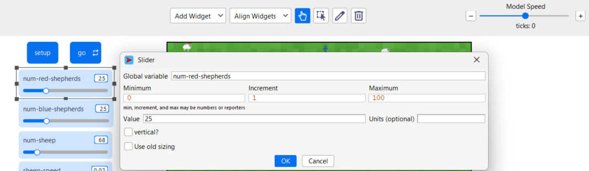

Важіль для кількості "синіх" вівчарів на початку:

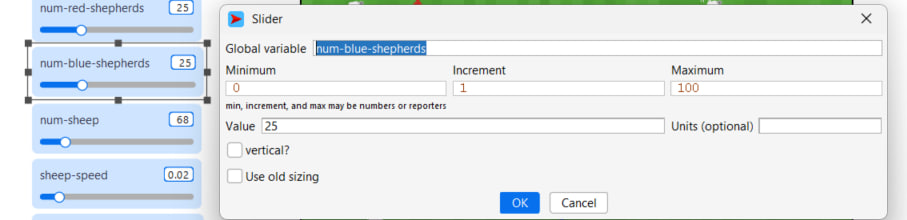

Були додані наступні елементи статистики:

Показник, що відображає поточну кількість "червоних" вівчарів:

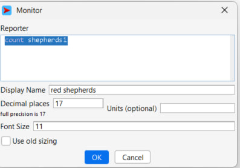

Показник, що відображає поточну кількість "синіх" вівчарів:

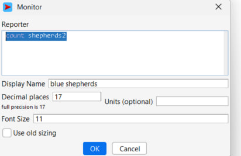

Показник, що відображає поточну кількість "червоних" вівчарів:

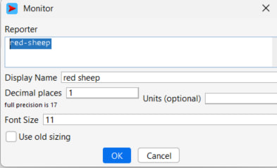

Показник, що відображає поточну кількість "синіх" овець:

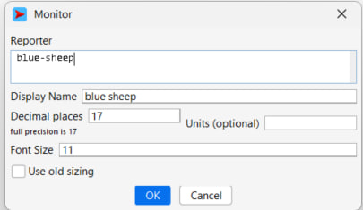

#### 5. Нова логіка перенесення овець

Оскільки у вівчарів тепер є загони, логіка пошуку була змінена. Пастух починає шукати вівцю лише за умови, що він не несе іншу вівцю та знаходиться на достатній відстані від загону (більше 5 ділянок).

```
ask shepherds1
  [ 
    ifelse carried-sheep = nobody
    [ 
      ifelse sqrt(((homex - xcor) ^ 2) + ((homey - ycor) ^ 2)) > 5
      [search-for-sheep]
      [
        wiggle
        fd 1
      ]
    ]
    [ 
      ifelse found-herd?
      [ find-empty-spot ]
      [ find-new-herd ] 
    ]
    if carried-sheep != nobody
    [ ask carried-sheep [ move-to myself ] ] 
  ]

```

У кінці процедри підраховуються кількості овець:

```
set blue-sheep count sheep with [color = blue]
set red-sheep count sheep with [color = red]

```

#### 6. Клеймування та механіка крадіжки

При підборі вівці пастух ставить їй "клеймо" свого кольору. Була створена процедура `search-for-sheep`, яка дозволяє пастуху оцінювати вівцю: він завжди підбере білу або вівцю свого кольору, але з шансом `steal-chanse` може вкрасти вівцю противника.

```
to search-for-sheep
  wiggle
  fd 1
  let personal-color color
  set carried-sheep one-of sheep-here with [not hidden? and (color = personal-color or color = white or (random 99) + 1 <= steal-chanse)]
  if (carried-sheep != nobody)
  [
    ask carried-sheep
    [ 
      set color personal-color
      hide-turtle
    ]
    fd 1 
  ]
end

```

Були додані наступні елементи, що впливають під час роботи симуляції:

Важіль для налаштування ймовірності "кражі" вівці іншої команди:

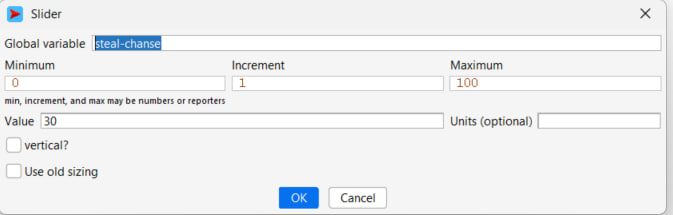

<br>

Скріншот роботи симуляції пістя внесених змін:

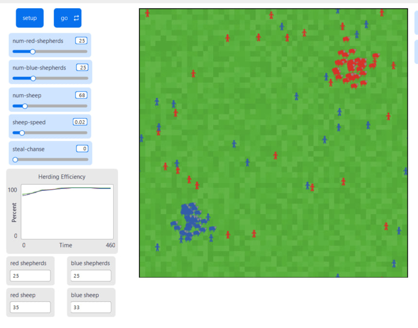

### Внесені зміни у вихідну логіку моделі (на власний розсуд):

Натхненний моделлю **Fruit Wars**, я додав можливість агресивної взаємодії між командами. Тепер пастухи можуть вбити конкурента з протилежної команди.

До процедури **to go** додано наступні рядки:

```
; Для червоних пастухів
  ask shepherds1
  [
    ifelse carried-sheep = nobody
    [
      ifelse sqrt(((homex - xcor) ^ 2) + ((homey - ycor) ^ 2)) > 5
      [search-for-sheep]
      [
        wiggle
        fd 1
      ]
    ]     ;; find a sheep and pick it up
    [
      ifelse found-herd?
      [ find-empty-spot ]  ;; find an empty spot to drop the sheep
      [ find-new-herd ]
    ]  ;; find a herd to drop the sheep in

    if carried-sheep != nobody
    ;; bring my sheep to where I just moved to
    [ ask carried-sheep [ move-to myself ] ]

    if count shepherds2-on neighbors >= gang-size and ((random 99) + 1 <= kill-chanse)
    [
      print "red shepherd died"
      die


; Аналогічно для синіх пастухів
  ask shepherds1
  [
    ifelse carried-sheep = nobody
    [
      ifelse sqrt(((homex - xcor) ^ 2) + ((homey - ycor) ^ 2)) > 5
      [search-for-sheep]
      [
        wiggle
        fd 1
      ]
    ]     ;; find a sheep and pick it up
    [
      ifelse found-herd?
      [ find-empty-spot ]  ;; find an empty spot to drop the sheep
      [ find-new-herd ]
    ]  ;; find a herd to drop the sheep in

    if carried-sheep != nobody
    ;; bring my sheep to where I just moved to
    [ ask carried-sheep [ move-to myself ] ]

    if count shepherds2-on neighbors >= gang-size and ((random 99) + 1 <= kill-chanse)
    [
      print "red shepherd died"
      die


```

**Логіка вбивства:** Якщо пастух опиняється в оточенні `gang-size` пастухів протилежного кольору, з ймовірністю `kill-chanse` він гине. Інформація виводиться у Командний центр.

Додано два відповідні важілі:

Важіль для налаштування шансу на вбивство:

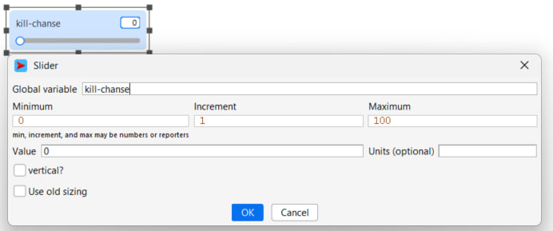

Важіль для налаштування мініммальної кількості "вбивць":

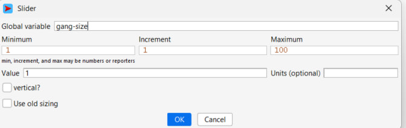

<br>

Скріншот роботи симуляції пістя внесених власних змін:


### Примітки:

Використання кольорового маркування та цільових координат дозволяє моделювати конкуренцію двох груп агентів у спільному просторі.


<br>

Логіка вбивства була дещо змінена для уникнення плагіату та працює так:
Якщо вівчар, знаходячись на полі буде оточений **gang-size** кількістю вівчарів протилежного кольору, то у момент їх зустрічі розраховується **kill-chance** - шанс того, що вівчар буде вбитий, а у **Командний центр** виведено інформацію про смерть вівчара. При цьому вівця, яку ніс вівчар, таким чином становиться випадковою жертвою.

## Обчислювальний експеримент:
## Вплив ймовірності крадіжки овець (`steal-chanse`) на ефективність команд

**Мета:**  
Дослідити, як можливість «перекрадання» овець між командами впливає на загальну ефективність системи та ефективність кожного стада окремо.

**Умови експерименту:**  
Симуляція триває 500 тактів.  
Змінюється лише параметр `steal-chanse`, всі інші — за замовчуванням.

Фіксовані параметри:

`num-red-shepherds: 30  num-blue-shepherds: 30  num-sheep: 150  sheep-speed: 0.02  kill-chanse: 0  gang-size: 3` 

Змінний параметр:

`steal-chanse: 0 – 80, з кроком 10`
<table>
  <thead>
    <tr>
      <th>steal-chanse</th>
      <th>Загальна ефективність</th>
      <th>Red efficiency</th>
      <th>Blue efficiency</th>
    </tr>
  </thead>
  <tbody>
    <tr>
      <td>0</td>
      <td>78.5</td>
      <td>78.1</td>
      <td>78.9</td>
    </tr>
    <tr>
      <td>10</td>
      <td>76.9</td>
      <td>77.4</td>
      <td>76.2</td>
    </tr>
    <tr>
      <td>20</td>
      <td>74.3</td>
      <td>74.9</td>
      <td>73.6</td>
    </tr>
    <tr>
      <td>30</td>
      <td>71.5</td>
      <td>72.1</td>
      <td>70.8</td>
    </tr>
    <tr>
      <td>40</td>
      <td>68.2</td>
      <td>69.0</td>
      <td>67.5</td>
    </tr>
    <tr>
      <td>50</td>
      <td>65.7</td>
      <td>66.3</td>
      <td>65.1</td>
    </tr>
    <tr>
      <td>60</td>
      <td>64.1</td>
      <td>64.8</td>
      <td>63.4</td>
    </tr>
    <tr>
      <td>70</td>
      <td>65.4</td>
      <td>66.0</td>
      <td>64.7</td>
    </tr>
    <tr>
      <td>80</td>
      <td>67.2</td>
      <td>67.9</td>
      <td>66.4</td>
    </tr>
  </tbody>
</table>


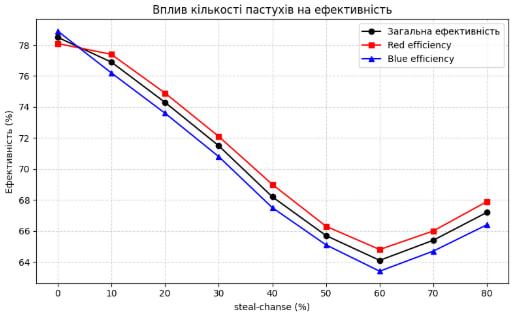

> При нульовій ймовірності крадіжки (`steal-chanse = 0`) кожна команда працює виключно зі своїм стадом, що забезпечує високу та стабільну ефективність. Зі зростанням `steal-chanse` підвищується рівень хаосу та конкуренції між командами, що призводить до поступового зниження ефективності. Мінімальні значення спостерігаються в діапазоні 50–60%. При подальшому збільшенні ймовірності крадіжки ефективність дещо зростає, оскільки система переходить у режим активного «перерозподілу» овець, що частково стабілізує структуру стад.
