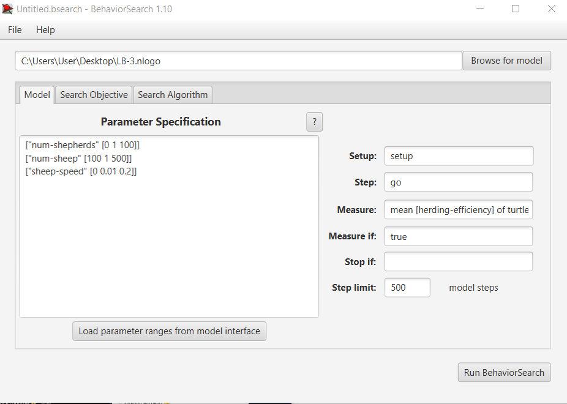
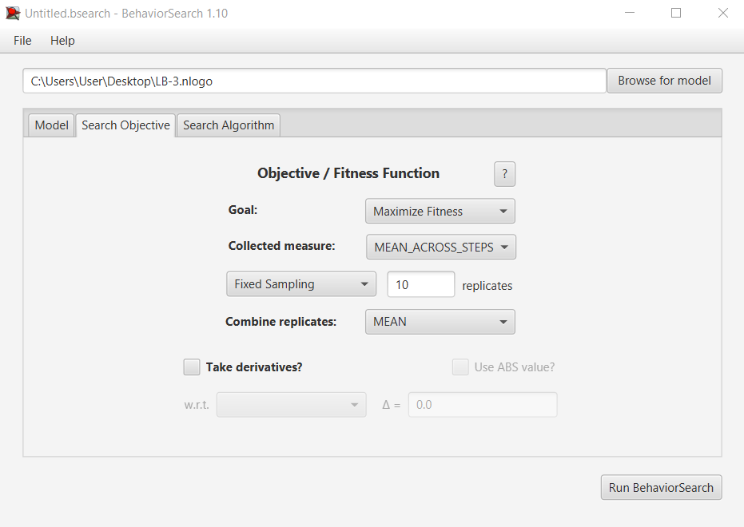
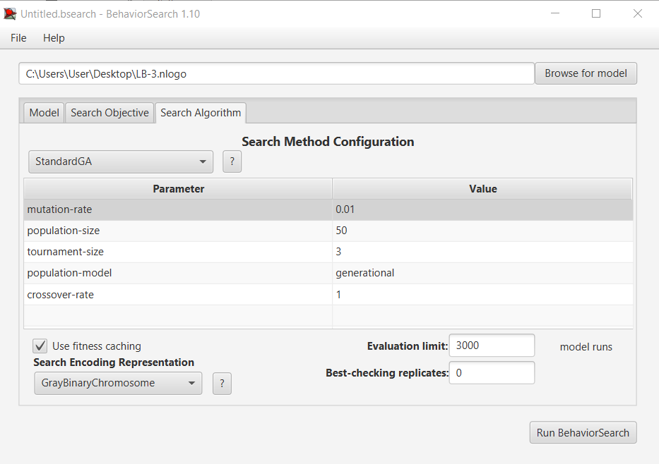
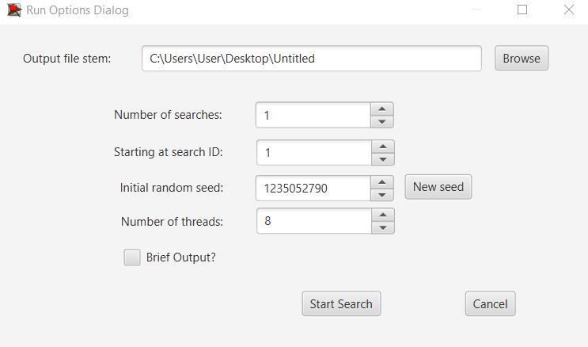
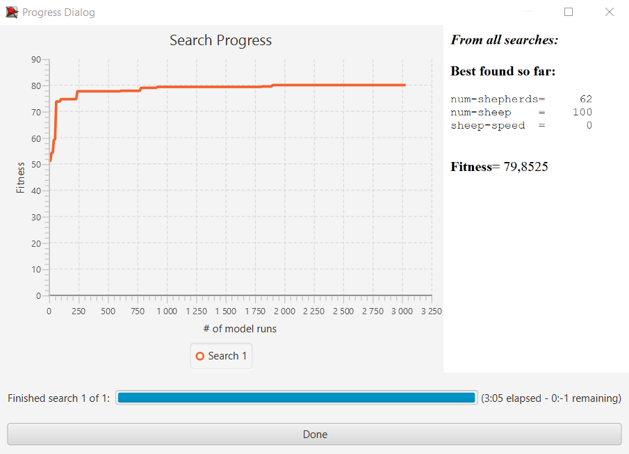
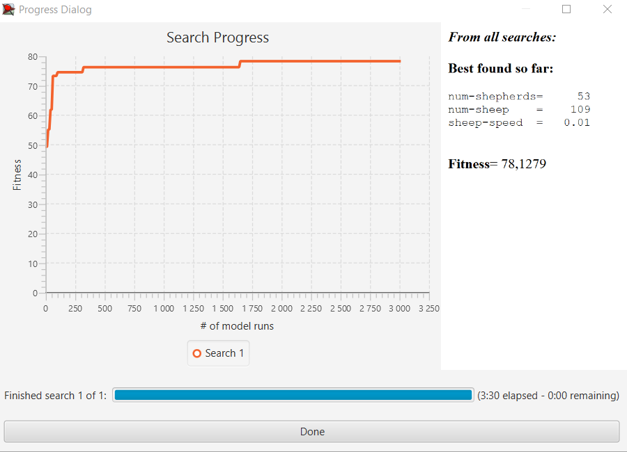
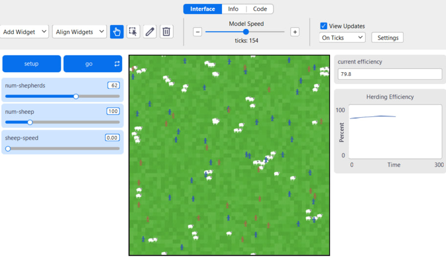

## Комп'ютерні системи імітаційного моделювання
## СПм-24-1, **Литовка Данило Вадимович**
### Лабораторна робота №**3**. Використання засобів обчислювального интелекту для оптимізації імітаційних моделей

<br>

### Варіант 9, модель у середовищі NetLogo:
[Sheperds](https://www.netlogoweb.org/launch#http://www.netlogoweb.org/assets/modelslib/Sample%20Models/Biology/Shepherds.nlogox)
Симуляція процесу пошуку та збирання вівць у стада.

<br>

### Вербальний опис моделі:

Симуляція збору овець пастухами у стадо. Пастухи дотримуються низки простих правил. Кожен пастух починає блукати випадковим чином. Якщо він натикається на вівцю, він підбирає її та продовжує безладно блукати. Коли він натикається на іншу вівцю (знаходить стадо), він шукає вільне місце поблизу, кладе свою вівцю та шукає іншу. З часом цей процес призводить до групування розрізнених овець у компактні стада.

### Керуючі параметри:

-   **num-sheep**: кількість овець у моделі. Цей параметр визначає, скільки овець буде створено під час ініціалізації моделі.
    
-   **num-shepherds**: кількість пастухів у моделі. Цей параметр задає кількість пастухів, які будуть взаємодіяти з вівцями.
    
-   **sheep-speed**: швидкість переміщення овець. Визначає, як швидко вівці рухатимуться по простору, що впливає на складність утримання стада.
    

### Внутрішні параметри:

-   **pcolor**: колір патчів (ділянок землі), який варіюється у відтінках зеленого для покращення візуалізації.
    
-   **sheep-nearby**: (змінна `patches-own`) кількість овець у сусідніх патчах; використовується для аналізу щільності розподілу овець.
    
-   **carried-sheep**: (змінна `shepherds-own`) посилання на вівцю, яку зараз несе пастух. Якщо пастух вільний, значення дорівнює `nobody`.
    
-   **found-herd?**: (змінна `shepherds-own`) булева змінна, яка стає `true`, коли пастух з вівцею знаходить іншу вівцю, сигналізуючи про готовність залишити вантаж.
    
-   **hidden?**: (вбудована змінна `sheep`) використовується для того, щоб зробити вівцю невидимою та "недоступною" для інших пастухів, поки її хтось несе.
    

### Показники роботи системи:

-   **sheepless-neighborhoods**: кількість патчів, навколо яких немає жодної вівці. Цей показник демонструє, наскільки територія очищена від розрізнених тварин.
    
-   **herding-efficiency**: ефективність збирання. Обчислюється як відсоткове співвідношення патчів без овець у їхньому оточенні до загальної кількості патчів без овець. Чим вищий відсоток, тим краще згруповані вівці.

<br>


### Налаштування середовища BehaviorSearch:

## Конфігурація імітаційної моделі

**Вибір моделі:** Для проведення дослідження було обрано файл моделі, розташований за шляхом: `\Desktop\LR3\Shepherds.nlogox`

### Налаштування параметрів (вкладка Model)

Визначення діапазонів варіювання параметрів відбулося в автоматичному режимі за допомогою функції **«Load parameter ranges from model interface»**. Це дозволило інтегрувати змінні безпосередньо з середовища NetLogo:

Plaintext

```
["num-shepherds" [0 1 100]]
["num-sheep" [100 1 500]]
["sheep-speed" [0 0.01 0.2]]

```

> **Примітка:** Мінімальну межу для кількості овець (`num-sheep`) було скориговано до **100**. Це зроблено для забезпечення валідності симуляції, оскільки при менших значеннях алгоритм оптимізації міг зводити популяцію до нуля, що позбавляло модель практичного сенсу.


### Визначення цільової метрики (Measure)

Як критерій ефективності (фітнес-функцію) обрано показник результативності збору овець. У полі **«Measure»** вказано наступний код: `mean [herding-efficiency] of turtles`

**Умови обчислення:**

-   **Тривалість:** Оцінка проводиться протягом **1000 тактів** (steps).
    
-   **Інтервал спостереження:** У параметрі **«Measure if»** встановлено значення `true`. Це означає, що дані збираються протягом усього циклу роботи. Це важливо для отримання стабільного середнього значення та нівелювання випадкових коливань, що можуть виникати на початкових етапах симуляції.
    
-   **Процедури:** Поля **«Setup»** та **«Go»** ініціалізують стандартні команди запуску моделі, які BehaviorSearch виконує автоматично під час кожної ітерації.


## Налаштування стратегії пошуку (Search Objective)

Основною метою є **максимізація** продуктивності роботи пастухів. У налаштуваннях це відображено через параметр **«Goal»** — **Maximize Fitness**.

**Ключові аспекти обробки даних:**

1.  **Агрегація за часом:** Для отримання цілісної картини ефективності обрано тип **MEAN_ACROSS_STEPS**. Це дозволяє оцінювати не миттєвий результат у фінальній точці, а середню якість роботи протягом усього пробігу (1000 кроків).
    
2.  **Статистична достовірність:** З огляду на стохастичну (випадкову) природу моделі, кожен набір параметрів тестується **10 разів**. Фінальний результат обчислюється як середнє арифметичне цих запусків, що мінімізує вплив випадкових факторів на підсумкову оцінку.

**Налаштування алгоритму пошуку** (вкладка Search Algorithm):  
*Для знаходження оптимальних параметрів у роботі порівнюються два підходи:

1.  **StandardGA (Простий генетичний алгоритм):** Використовує принципи еволюції для пошуку найкращого рішення.
    
2.  **RandomSearch (Випадковий пошук):** Базовий метод, що дозволяє оцінити ефективність інтелектуального алгоритму порівняно з хаотичним перебором.
    

**Технічні параметри пошуку:**

-   **Evaluation limit:** Встановлює ліміт ітерацій (або кількість поколінь для ГА).
    
-   **Search Space Encoding Representation:** Визначає метод кодування простору параметрів. Оскільки універсального методу не існує, вибір конкретного кодування залежить від специфіки поведінки моделі.
    

----------

## Результати оптимізації BehaviorSearch

Нижче наведено візуалізацію процесів та результатів пошуку для обох алгоритмів.

<br>

### Результати використання BehaviorSearch:
Діалогове вікно запуску пошуку :  

<br>

Результат пошуку параметрів імітаційної моделі, використовуючи **генетичний алгоритм**:  

<br>

Результат пошуку параметрів імітаційної моделі, використовуючи **випадковий пошук**:  


## Детальна інтерпретація показників

### 1. Ефективність алгоритмів

-   **Генетичний алгоритм (GA)** виявився ефективнішим за випадковий пошук, досягнувши вищого показника фітнес-функції (**79,85** проти **78,13**). Це підтверджує, що для даної моделі еволюційний підхід краще знаходить оптимальні комбінації параметрів у багатовимірному просторі.
    
-   **Графік прогресу:** У генетичного алгоритму спостерігається більш плавне та стабільне зростання ефективності, що свідчить про поступову "селекцію" кращих рішень, тоді як випадковий пошук швидко виходить на плато і залежить від удачі при виборі точок.
    

### 2. Вплив параметрів на результат

-   **Число пастухів (`num-shepherds`):** Обидва алгоритми вказують на те, що для високої ефективності потрібна значна кількість пастухів (більше 50). Проте GA визначив, що збільшення їх кількості до **62** дає кращий результат.
    
-   **Число овець (`num-sheep`):** Генетичний алгоритм максимально наблизився до встановленої нами межі в **100** особин. Логіка моделі підказує: чим менше об’єктів потрібно зібрати, тим вищою буде середня ефективність збору на кожну одиницю.
    
-   **Швидкість овець (`sheep-speed`):** Обидва методи зійшлися на тому, що швидкість овець має бути мінімальною (**0** або **0,01**). Це цілком логічно: чим менше вівці чинять опір і розбігаються, тим легше пастухам виконувати свою роботу, що максимізує цільову функцію.
    <br>

Тестування в NetLogo параметрів імітаційної моделі, використовуючи **генетичний алгоритм**:  



----------

## Висновки

Найкращу конфігурацію параметрів для максимізації ефективності збору (`herding-efficiency`) знайдено за допомогою **StandardGA**. Оптимальні умови передбачають залучення **62 пастухів** для збору мінімальної групи у **100 овець**, які мають **нульову швидкість** пересування.

Ці результати демонструють, що модель дуже чутлива до швидкості об'єктів та щільності пастухів відносно череди.